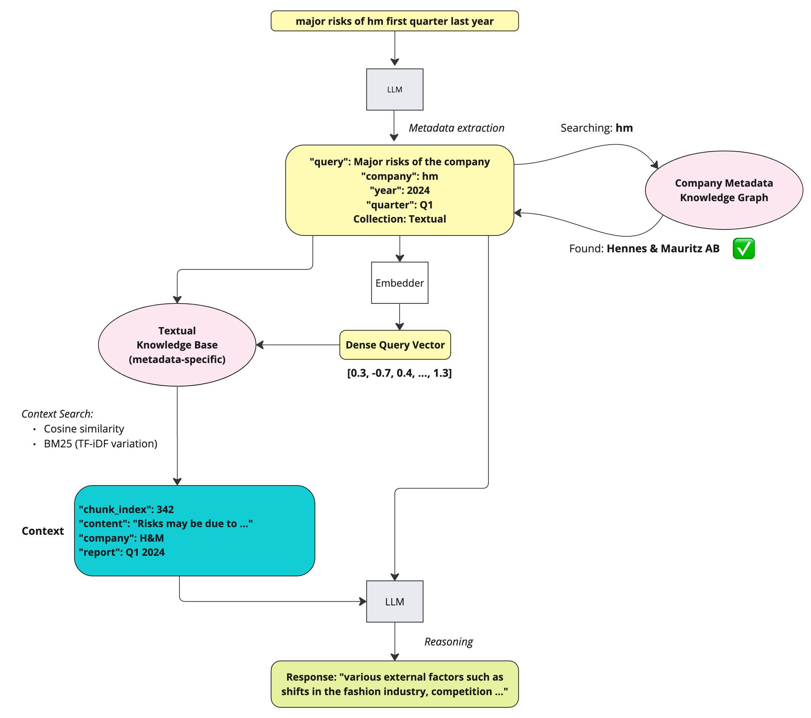
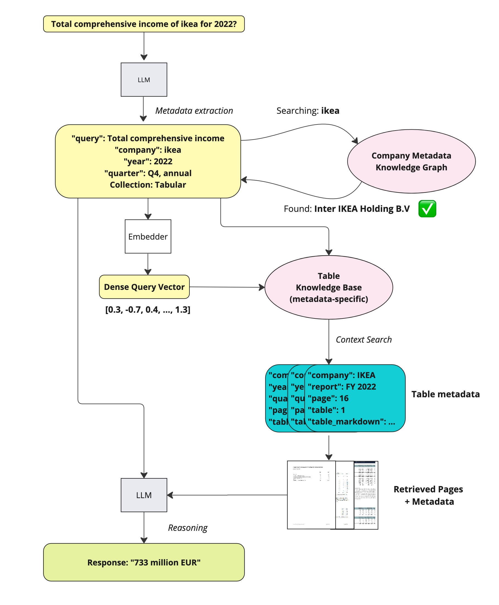

# AI Assistant "Kapital"

### Developed as part of [Hack Genesis 2024](https://hackgenesis.com/) by team "Счастье не за горами" ("Happiness is not far away").


## Use Cases

### Unstructured Data Search (Qualitative Questions)



Information search on a given topic based on unstructured data (text).

----

### Structured Data Search (Quantitative Questions)



Information search on a given topic based on structured data (tables).

----


## Solution Architecture


* The assistant engine is developed using LangChain.
* OpenAI is used as the LLM, enhanced with Tools and Prompts for interacting with the external world.
* OpenAI Embeddings + BM25 search are used for the RAG approach.
* Knowledge graphs are used to store company metadata.

### Project Structure

```
├── app # main project directory
│   ├── common # common utilities and tools
│   │   ├── __init__.py
│   │   ├── knowledge_graphs.py # knowledge graph processing tools
│   │   ├── streamlit_texts.py # UI text constants
│   │   ├── structured_tools.py # tools for structured data processing
│   │   ├── unstructured_tools.py # tools for unstructured data processing
│   │   └── utils.py # helper functions
│   ├── chatbot.py # project start file
├── data # contains data and DB for the project
├── docker-compose.yml
├── Dockerfile
├── README.md
└── resources # repo resources
```

# How to run?

## Development

0. Install requirements

```
pip install -r requirements.txt
```

1. Create `.env` in the `./app` dir

```
cp .env.example .env
echo "OPENAI_API_KEY=your-actual-key" >> .env
```

2. Run with Python from the `./app`

```
python3.10 -m streamlit run chatbot.py
```

3. Use it on port `8501` by default

e.g. for local development, try the app at 'http//:localhost:8501'


## Production with Docker


1. Create `.env-prod`

```
cp .env.example .env-prod
echo "OPENAI_API_KEY=your-actual-key" >> .env-prod
```

2. Run with docker-compose in the root dir

```
docker-compose build
docker-compose up
```

3. Use it on port `8501` by default

e.g. for local development, try the app at 'http//:localhost:8501'
