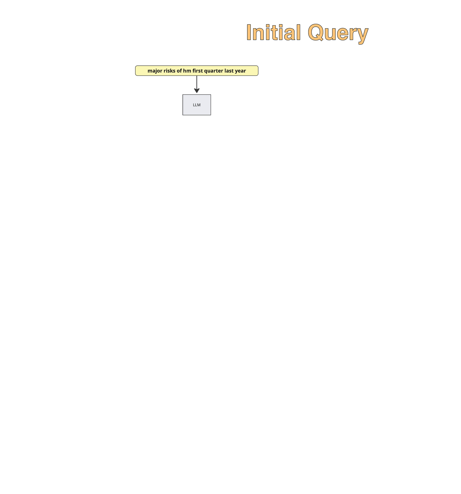
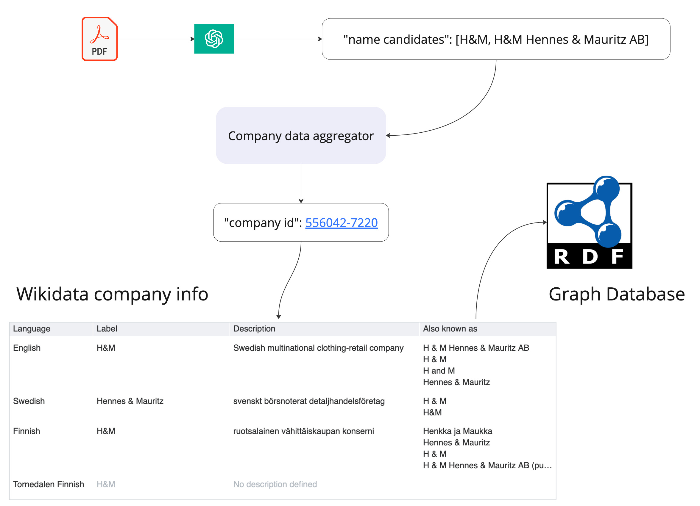
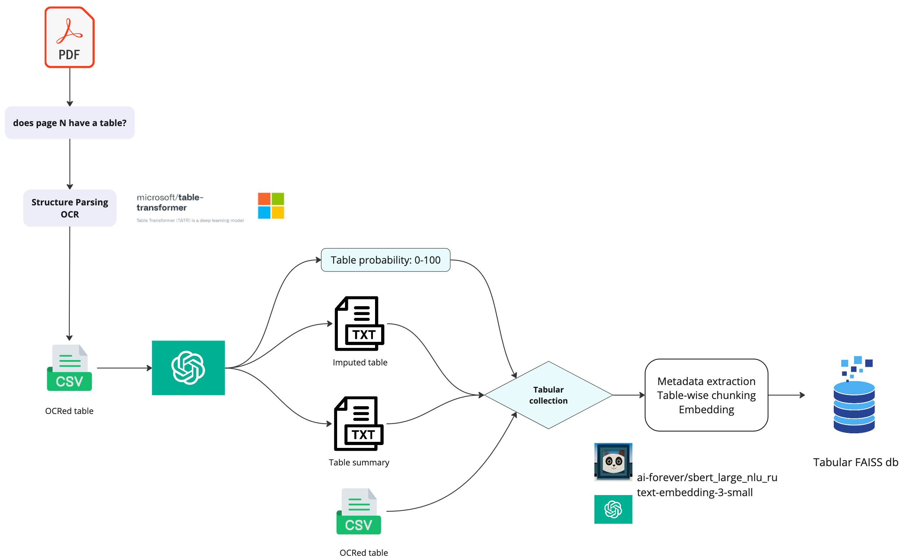
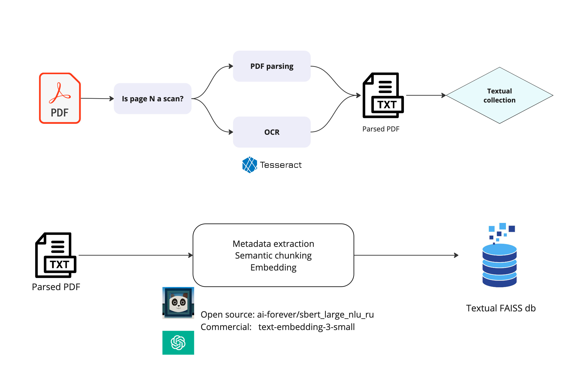

# "Kapital" Assistant
AI-powered interface to chat over the financial reportings. 🤖

This is a slightly polished version of what we have built at [Hack Genesis 2024](https://hackgenesis.com/) which secured as the first place. 🏆

The project is live, [**check it out here.**](https://kapital-assistant.vercel.app/)

Currently, only limited number of reports is available, look at the demo page for more details.

The stack overview:

- Python, FastAPI, Docker, AWS EC2 for backend;
- LangChain for LLM agent management;
- [FAISS](https://github.com/facebookresearch/faiss) for dense vector storage;
- [Microsoft Table Transformer](https://huggingface.co/microsoft/table-transformer-detection) for table extraction;
- Next.js, TypeScript, and Vercel for the frontend.

## System Design



Key stages:
* LLM agent refactors a user query and extracts metadata;
* Metadata is passed through the knowledge graph to match the query with the correct company document collection;
* The LLM agent calls the appropriate retriever tool to search within the company collection for a specified period for either of two options:
  - structural data (tabular entries), or
  - unstructured information (text);
* Hybrid search (vector similarity + BM25) is used for the RAG. For structural collections, search is performed against OCRed tables with LLM-extracted metadata;
* LLM chooses the most relevant documents, sends the sources to the user and provides the synthesized response.

----

### Unstructured Data Search (Qualitative Questions)


Information search on a given topic based on unstructured data (text).

----

### Structured Data Search (Quantitative Questions)


Information search on a given topic based on structured data (tables).

----

### Knowledge Graphs for query routing



The use of knowledge graph helps quickly map the user-used company name with the correcte knowledge database.

----

### Data Ingestion Pipeline

#### Structured Data (Tables)


----

#### Unstructured Data (Text)


----


## Getting Started

### Backend Setup

1. Clone the repository:
```bash
git clone git@github.com:dm-shr/kapital-assistant.git
cd kapital-assistant
```

2. Set up environment variables:
```bash
cp .env.example .env
```

Generate two secure API keys for development and production:
```bash
openssl rand -base64 32
```

Add both to your `.env` file, comma-separated, along with other required variables.

**NOTE**: You would also need an OpenAI API key for the current project implementation.

3. Download required data:
```bash
chmod +x get-data.sh
./get-data.sh
```

4. Start the backend services:
```bash
docker-compose up -d --build
```

5. (Optional) Set up ngrok for external access:
```bash
ngrok http 8000 # you may also specify the domain
```

You would need to install [**ngrok**](https://ngrok.com/) for that.

### Frontend Setup

1. Development:
```bash
cd frontend
cp .env.local.example .env.local
# Add your configuration to .env.local
npm install
npm run dev
```

2. Production:
Vercel was used for deployment here.
1. Connect your GitHub repository
2. Add environment variables in Vercel project settings:
   - `PROD_API_URL`: Your backend API URL
   - `PROD_API_KEY`: Your API key (must match backend's API_KEYS)
   - `DEV_API_URL`: Your backend API URL for development
   - `DEV_API_KEY`: Your development API key (must match backend's API_KEYS)

## Codebase Structure

```plaintext
  # Backend application
├── app/

    # FastAPI application
│   ├── api.py

    # Core utilities and tools
│   ├── common/

      # Common parameters and prompts
│   │   ├── __init__.py

      # Company database matching logic
│   │   ├── knowledge_graphs.py

      # Agent tools for tabular analysis
│   │   ├── structured_tools.py

      # Agent tools for text analysis
│   │   ├── unstructured_tools.py

      # Shared utility functions
│   │   └── utils.py

    # YAML-based prompt templates
│   └── prompts/

  # Next.js web application
├── frontend/

  # Project data and vector databases
├── data/

  # Backend container definition
├── Dockerfile

  # Multi-container orchestration
└── docker-compose.yml
```

## Authors

- [Dmitrii Shiriaev](https://www.linkedin.com/in/dshiriaev/)
- [Aleksandr Perevalov](https://www.linkedin.com/in/aleksandr-perevalov/)
- [Vladislav Raskoshinskii](https://www.linkedin.com/in/vladislav-raskoshinskii/)
- [Ilya Moshonkin](https://www.linkedin.com/in/ilyamoshonkin/)

## Connect?

[](https://github.com/dm-shr)
[](https://www.linkedin.com/in/dshiriaev/)
