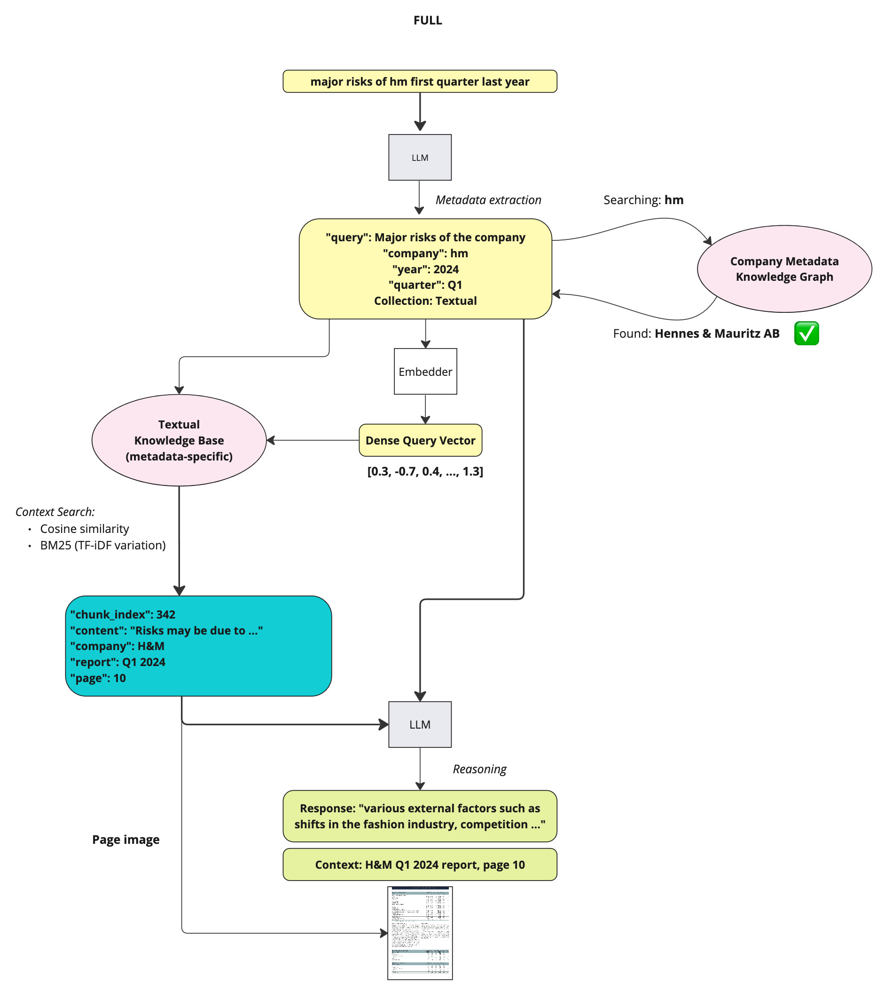

# AI Assistant "Kapital"
Smart AI-powered interface to chat over the financial reportings. 🤖

This is a slightly polished version of what we built at [Hack Genesis 2024](https://hackgenesis.com/) as a teams "Счастье не за горами" ("Happiness is not far away"), which secured as the first place. 🏆

The project is live, [**check it out here.**](https://kapital-assistant.vercel.app/)

## Codebase

```
├── app                     # Backend application
│   ├── api.py             # FastAPI application
│   ├── common             # Common utilities and tools
│   │   ├── __init__.py   # Prompts and common params
│   │   ├── knowledge_graphs.py
│   │   ├── structured_tools.py
│   │   ├── unstructured_tools.py
│   │   └── utils.py
│   └── prompts           # YAML prompt templates
├── frontend             # Next.js frontend application
├── data                 # Contains data and DB for the project
├── Dockerfile          # Backend Dockerfile
└── docker-compose.yml  # Docker compose configuration
```

## Getting Started

### Backend Setup

1. Clone the repository:
```bash
git clone git@github.com:dm-shr/kapital-assistant.git
cd kapital-assistant
```

2. Set up environment variables:
```bash
cp .env.example .env
```

Generate a secure API key:
```bash
openssl rand -base64 32
```

Add it to your `.env` file along with other required variables.

**NOTE**: You would need an OpenAI API key for that.

3. Download required data:
```bash
chmod +x get-data.sh
./get-data.sh
```

4. Start the backend services:
```bash
docker-compose up -d --build
```

5. (Optional) Set up ngrok for external access:
```bash
ngrok http 8000
```

### Frontend Setup

1. Development mode:
```bash
cd frontend
cp .env.development.example .env.development
# Add your configuration to .env.development
npm install
npm run dev
```

2. Production deployment:
- Deploy to Vercel:
  1. Connect your GitHub repository
  2. Add environment variables in Vercel project settings:
     - `PROD_API_URL`: Your backend API URL
     - `PROD_API_KEY`: Your API key (must match backend's API_KEYS)


## Architecture Overview



----


Key points:
* The assistant engine is developed using LangChain.
* The agent app is using Tools for interacting with the external world.
* Hybrid search (vector similarity + BM25) is used for the RAG.
* Knowledge graphs are used to store company metadata and route user query to the correct company collection.

### Unstructured Data Search (Qualitative Questions)


Information search on a given topic based on unstructured data (text).

----

### Structured Data Search (Quantitative Questions)


Information search on a given topic based on structured data (tables).

----

### Knowledge Graphs for query routing


The use of knowledge graph helps quickly map the user-used company name with the correcte knowledge base

----

### Data Ingestion Pipeline

#### Structured Data (Tables)


----

#### Untructured Data (Text)


----

## Authors

- [Dmitrii Shiriaev](https://www.linkedin.com/in/dshiriaev/)
- [Aleksandr Perevalov](https://www.linkedin.com/in/aleksandr-perevalov/)
- [Vladislav Raskoshinskii](https://www.linkedin.com/in/vladislav-raskoshinskii/)
- [Ilya Moshonkin](https://www.linkedin.com/in/ilyamoshonkin/)

## Connect With me

[](https://github.com/dm-shr)
[](https://www.linkedin.com/in/dshiriaev/)
